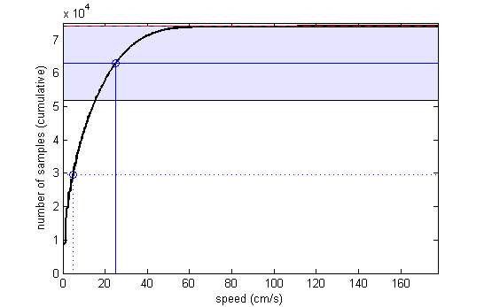

The major functions here are:    
* [eeg_instant_freq_power](#eeg_instant_freq_power) - converts eeg signal to analytical function    
* [eeg_power_spectra](#eeg_power_spectra) - produces and analyses the eeg power spectrum    
* [intrinsic_freq_autoCorr](#intrinsic_freq_autoCorr) - produces and analyses a power spectrum using spike times    

Normally you will want to perform this analysis on sections of data where speed is above some threshold. If this is the case you may want to use [adjust_median_speed](#adjust_median_speed).    

----    
[intrinsic_freq_autoCorr](#intrinsic_freq_autoCorr) | [eeg_instant_freq_power](#eeg_instant_freq_power)  | [power_spectrum](#power_spectrum) | [eeg_power_spectra](#eeg_power_spectra) | [adjust_median_speed](#adjust_median_speed)

----       

### <a name="intrinsic_freq_autoCorr"/> intrinsic_freq_autoCorr &#9827;       
   
This function ultimately uses [power_spectrum](#power_spectrum) to produce a spectrum and peak detection analysis of the same kind as that in [eeg_power_spectra](#eeg_power_spectra), however here the input timeseries is constructed from autocorrelograms rather than being an eeg signal. For each contiguous section of pos in `posMask` a spike histogram is produced and the autocorrelogram is found. The indivual autocorrelograms are then combined (using weights) and normalised to produce a single autocorrelogram to be passed into [power_spectrum](#power_spectrum).      

**Warning**    
Calculating `s2n` against full freq band for bat study.    

**Takes**    
`spikeTimes` - time of all spikes emited by cell in seconds    
`posMask` - vector of logicals specifiying which of the pos samples to use    
`acBinSize=0.002` - temporal resolution of temoral autocorr in seconds    
`acWindow=0.5` - amount of autocorr in s that is considered i.e. only construct powerspec of 0 to this value in seconds    
`thetaRange=[7 11]` - `[low high]` values in Hz    
`padToPow2=16` - fft is best done on data padded to a power of 2 length. If NaN the next highest power of 2 is used, otherwise the specified power of 2 is used. Also, see note below.    
`smthKernelWidth=2` - in Hz, the width of the Gaussian kernel used to smooth the power spectrum (width of the whole kernel, not the shape of the curve).    
`smthKernelSigma=0.1875` - in Hz, the sigma of the Gaussian kernel used to smooth the power spectrum    
`maxFreq=25` - in Hz, the spectrum is cropped to this frequency.    
`s2nWidth2` - in Hz, the full width around the central theta value in which to measure "signal" power, power outside this range is "noise".    
`ymax` - see [power_spectrum](#power_spectrum)   
`PLOT_ON` - if true a plot of the result is shown      

**Returns**    
`autoCorrSum`  - temporal autocorrelation of all pos chunks from 0:acWindow seconds    
`lags`  - temporal lags in s that match bins of autoCorrSum    
`power`  - power from power spectrum for 0 to 25Hz    
`freqs`  - frequncies that match the bins of power    
`maxPower`  - peak power found from power spec in thetaRange    
`maxFreq`  - frequency coresponding to maxPower    
`s2n`  - signal to noise - power in band around theta peak divided by power in rest of freqs    

**Plot**    
Main plot is produced by [power_spectrum](#power_spectrum). Note that the smoothing makes little difference given that the highly-padded fft produces a smoothed result. The image in the top right shows all the individual autocorrelograms (which were combined into one before being fft-ed).    

**Note**    
In order to increase the resolution of the spectrum (and thus stand a chance at decent peak detection) you need to set `padToPow2` to be    
at least 12, 16 is good (and default).    

### <a name="eeg_instant_freq_power"/> eeg_instant_freq_power  &#9827;   
Takes EEG sequence, mean normalizes, band pass filters, and then applies the Hilbert transform to get a complex-valued analytic function. From this it is easy to get the instantaneous phase, amplitude, and frequency.    
   

**Takes**    
`eeg`  - eeg sequence in full (without timestamps). Should already be converted to volts for meaningful results    
`filterRange`  - `[low high]` in Hz, the frequency band of interest    
`header` - eeg file header, needed for 'EEG_samples_per_position' key    
`PLOT_ON` - if true a plot is produce    

**Returns**    
`freqEEGposHz`  - frequency of eeg at each position point, downsampled from EEG frequency to match pos frequency.    
`ampEEG50hz`  - amplitude of eeg at each position point, downsampled as above   
`phaseEEG`  - phase of signal at each eeg sample point, unwrapped to make it monotonically increasing. Use `mod(..,2**pi)` to convert to interval `[0,2pi]`. Peak of EEG is defined as `n**2pi` for integer n.    
`ampEEG`  - amplitude of eeg at each eeg sample pooint (normally 250hz)    
`filteredEEG`  - eeg timeseries filtered according to input variables    

**Plot**    
The plot on the right shows a zoomed in section of the eeg in pale gray. In thick dark gray is the mean-normalised-then-filtered signal, though this is mostly hidden behind the thin red line, which is its Hilbert transform. In blue is shown `ampEEG`, and the colors along the x-axis show the phase. (Note that instantaneous frequency, which is the derivative of phase, is not shown here.)    

### <a name="power_spectrum"/> power_spectrum    
   
Used by [eeg_power_spectra](#eeg_power_spectra) and [intrinsic_freq_autoCorr](#intrinsic_freq_autoCorr).    

Takes the input timeseries and produces a power spectrum by performing the FFT and subsequently discarding half the spectrum and doubling the power in the remaining half. Finally the spectrum is smoothed with a Gaussian kernel. The plot shows, in grey, the un-smoothed spectrum, and in black the smoothed spectrum. After producing the spectrum, the function finds the maximum power (red stem) in the band between the two blue dashed lines (which usually defines the theta band). Then, to get the signal-to-noise ratio it calculates the mean power in the red window around the peak and divides by the mean power in the rest of the spectrum.    

`function ret = power_spectrum(signal, padToPow2, binWidthSecs, freqBand, maxFreq, smthKernelWidth, smthKernelSigma, s2nWdth, PLOT_ON, ymax)`    

**Takes**    
`signal` - timeseries    
`padToPow2` - fft is best done on data padded to a power of 2 length. If NaN the next highest power of 2 is used, otherwise the specified power of 2 is used. Padding also creates a smoother spectrum.    
`binWidthSecs` - the width of `signal` bins in seconds    
`freqBand` - the band in which to look for a peak - see plot.    
`maxFreq` - in Hz, the spectrum is cropped to this frequency.    
`smthKernelWidth` - in Hz, the width of the Gaussian kernel used to smooth the power spectrum (width of the whole kernel, not the shape of the curve).    
`smthKernelSigma` - in Hz, the sigma of the Gaussian kernel used to smooth the power spectrum    
`s2nWidth` - in Hz, the full width around the central theta value in which to measure "signal" power, power outside this range is "noise".    
`PLOT_ON` - if true a plot of the result is shown, as on the right here.    
`ymax` - controls the ylimit when plotting. If `[]` a sensible value will be chosen.   

**Returns**    
A structure is returned with the following fields:    
`power`  - smoothed power spectrum    
`freqs`  - frequencies for the values in `power`    
`maxPower`  - peak power from powerspectrum in theta range    
`maxFreq`  - frequency at which peak power occurred    
`s2n`  - signal to noise - power in band around theta peak divided by power in rest of freqs    
  
### <a name="eeg_power_spectra"/> eeg_power_spectra  &#9827;   
This is really just a wrapper for [power_spectrum](#power_spectrum), for easy use with a subset of eeg data. See [power_spectrum](#power_spectrum) for an example plot.    

**Takes**    
`pos2use` - if empty, the whole of the eeg is used. Otherwise just the eeg samples corresponding to the given pos indicies are used. Note that there are multiple eeg samples per pos sample (usually 5).    
`eeg` - vector of eeg samples (no timestamps)    
`header` - eeg file header, needed for 'EEG_samples_per_position' key     
`sampFreq=250` - the value given in the eeg header as 'sample_rate', normally 250, i.e. 250Hz    
`thetaRange=[7 11]` - [low high] values in Hz    
`padToPow2` - fft is best done on data padded to a power of 2 length. If NaN the next highest power of 2 is used, otherwise the specified power of 2 is used.    
`smthKernelWidth=2` - in Hz, the width of the Gaussian kernel used to smooth the power spectrum (width of the whole kernel, not the shape of the curve).    
`smthKernelSigma=0.1875` - in Hz, the sigma of the Gaussian kernel used to smooth the power spectrum    
`maxFreq=25` - in Hz, the spectrum is cropped to this frequency.    
`s2nWidth` - in Hz, the full width around the central theta value in which to measure "signal" power, power outside this range is "noise".   
`ymax` - see [power_spectrum](#power_spectrum)    
`PLOT_ON` - if true a plot of the result is shown, as in [power_spectrum](#power_spectrum).    
   
**Returns**    
`power`  - smoothed power spectrum    
`freqs`  - frequencies for the values in `power`    
`maxPower`  - peak power from powerspectrum in theta range    
`maxFreq`  - frequency at which peak power occured    
`s2n`  - signal to noise - power in band around theta peak divided by power in rest of freqs    

**Notes**    
For a meaningful power result eeg must be in volts (latest version of trial loading code does this by default).    

   
### <a name="adjust_median_speed"/> adjust_median_speed &#9827;    
   
Gives the indices of all pos samples with speed between two specific values. The two values are chosen such that the median speed of the resulting pos samples ends up being equal to `grandMedian`. The lower value is also guaranteed to be greater than `minSpeed`.    

**Takes**    
Input is a structure with the following fields:    
`speed` - vector of speeds from pos data, one for each pos sample.    
`grandMedian` - the target median value.    
`minSpeed` - threshold in cm/s, below which samples should not be used.    
`PLOT_ON` - if true a plot is produced showing what was done, as on the right here.    

**Returns**    
A single structure is returned, with the following field:    
`allowedPosSamples` - indices into pos to use if you want the median to equal `grandMedian`    

**Plot**    
The plot shows the cumulative distribution of speed values for all pos samples. The section in red at the top corresponds to the number of NaN values. The solid blue line shows the desired median, the dashed blue line shows the minimum threshold. The shaded region shows the selection of speeds chosen in order that the median should be as requested.
