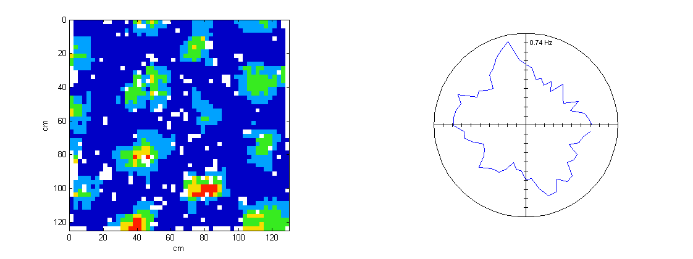
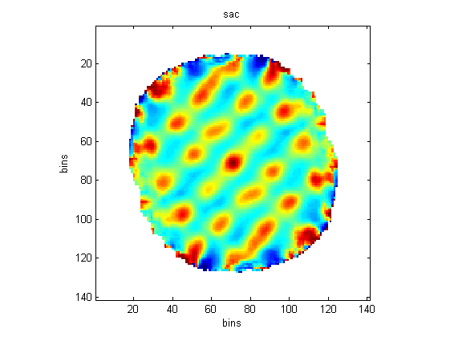
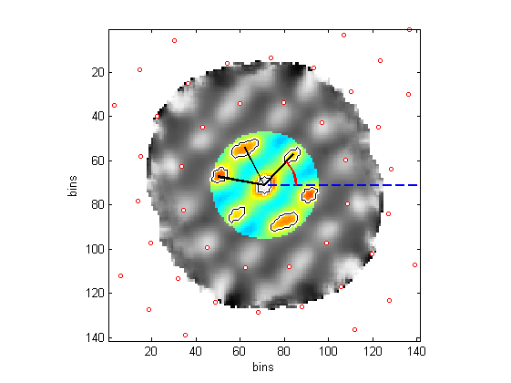

GridAnalysis is a set of functions which allow you to create a spatial ratemap and then calculate various properties such as gridness and scale. 

   
----   
 
[GetRatemap](#GetRatemap) | [shuffledGridness](#shuffledGridness) |
[toBinUnits](#toBinUnits) | [tintplot](#tintplot) | [autoCorr2D](#autoCorr2D) |
[crossCorr2D](#crossCorr2D) | [maxLikelihoodRate](#maxLikelihoodRate) |
[autoCorrProps](#autoCorrProps) | [disc_DAC](#disc_DAC) |
[t_win_SAC](#t_win_SAC) | [t_win_SCC](#t_win_SCC) | [cluster_quality](#cluster_quality) |
[skaggsInfo](#skaggsInfo)  | [lookup_ideal_rate](#lookup_ideal_rate) | [cumrot](#cumrot) |
[make_model_GC_module](#make_model_GC_module)


----    

### <a name="GetRatemap" /> GetRatemap &#9827;    

**Example**      
Here we assume that the variable `trial` is the output from [load_trial](LoadData#-load_trial). You can then produce a ratemap for cell 5 on tetrode 3 using the following:
```matlab
sp = trial.spikeData(3); 
in.spikePosInd = sp.pos_sample(sp.cut==5);
in.posXY = trial.posData.xy;
ratemap = GetRatemap(in);
```

This produces the image on the left of the figure below:



To produce a polar plot change the MAP_TYPE fieldname from 'rate' to 'dir' as follows then call GetRateMap again:

```matlab
in.MAP_TYPE = 'dir'
ratemap = GetRateMap(in)
```
Which will produce a plot similar to that on the right-hand side of the above figure

**Takes**    
The function expects a single structure with some or all of the following fields:

`posXY` - `[n x 2]` - matrix with one column for x and one column for y.  Values in centimeters.   
`posDir` - `[n x 1]` - a vector with one column for direction. Values in degrees (**not **radians).   
`spikePosInd` - `[m x 1]` - the indices into pos when spikes occurred for the cell.   
`pos_samprate=1` - value in Hz, usually around `50`.  If you leave it as `1` the values in the ratemap will not be in Hz.   
`SMOOTHING=5` - box car width in bins for smoothing   
`BIN_SIZE_CM=2.5` - as it says   
`BIN_SIZE_DEG=6` - ditto   
`PLOT_ON=true` - if true it uses tintplot to display the resulting map   

**Returns**   
`map` - matrix with rate values in Hz.   


### <a name="shuffledGridness" /> shuffledGridness &#9827;    
   

**Takes**    
The function expects a single structure with some or all of the following fields:   
`posXY` - `[n x 2]` - matrix with one column for x and one column for y.  Values in centimeters.   
`spikeTS` - '[m x 2]' - the timestamps of spikes for the cell   
`psr` - pos sample rate     
`BINSIZE=[2 2]` - in cm   
`SMOOTHING` - box car size in bins   
`MIN_SHIFT_SECONDS=1` - shuffles cannot be within this amount of actual data   
`SHUFFLES=1000` - number of shuffles to perform     
`TOL=10^-10` - see [autoCorr2D](#autoCorr2D)   
`PLOT_ON=true` - when true it displays a cumulative density plot of the griddness - see example above.
`autocorr_in.GET_MEAN_R_AND_SCALE=false` - these settings are passed on to [autoCorrProps](#autoCorrProps)...     
`autocorr_in.GET_ORIENTATION=false`    
`autocorr_in.FIELD_EXTENT_METHOD=2`    
`autocorr_in.PLOT_ON=false`    
    
**Returns**   
`gridness` - the (unshuffled) gridness value    
`gridnessShuffles` - vector of length `SHUFFLES` giving the gridness values     

### <a name="toBinUnits" /> toBinUnits    
This function takes in n-dimnesional "raw data" and divides it by some specified bin size in each dimension.  Values are then clamped to lie within the specified range.  Apply `ceil` to the output to get bin indices for use with `accumarray` etc.

**Note for people who have previously used histnd**    
This function supersedes `histnd`, but doesn't do quite the same thing.  It only takes raw data and converts it to bin units.  To do `histnd` with the data you need to use Matlab's `accumarray` function, using `ceil(binUnits)` as the indices and `1` as the value to accumulate. The benefit of this is that the calling function can do something more interesting with the bin units if it needs to.

`binUnits = toBinUnits(nd_data, nd_data_ranges, binsizes,setToValue)`   

**Takes**    
`nd_data` - `[n_data_points x Ndims]`, e.g. one column for x data, one for y, and one for direction.      
`nd_data_ranges` - is either:   

1. an `[2 x Ndim]` array in which each column contains the minimum & maximum permitted of the `nd_data` in the corresponding column of `nd_data` e.g. for x-by-y-by-dir spatial data,  `nd_data_min_max = [window_min_x window_min_y 0; window_max_x window_max_y 360]`.   

1. a `[1 x Ndim]` array of just the maximum values e.g. `[window_max_x window_max_y 360]`. This option remains for reasons of backward compatibility. This option assumes that the data is zero-centred (which is not always the case).   

`binsizes` - `[1 x Ndim]` the size of the bins to be used for the corresponding columns of `nd_data`. e.g. for spatial data, '[8 8 6]'. The units are the same as in `nd_data`.

### <a name="tintplot" /> tintplot  &#9827;     

Plots a matrix using Tint's 5-color palette, setting NaNs to be white.  Note that you can just use Matlab's `imagesc` function if you aren't too concerned about colors.

**Takes**   
A single structure with the following fields:   
`im` - the matrix to image   
`NUM_COLORS=5` - the number of colors in the palette. Currently this has to be set to `5`.   
`AXIS_LIMS` -  `[x_min x_max; y_min y_max]` changes axis values from pixels to your chosen scale, the values should correspond to the centres of the outermost bins.   
`CLIM` - caps the `im` at the specified maximum value.   


### <a name="autoCorr2D" /> autoCorr2D &#9827;      
Performs auto-correlation of 2D maps (or stacks of 2D maps) using FFT. FFT is faster than a basic convolution in most cases, especially with large data sets. (See [the convolution theorem](http://en.wikipedia.org/wiki/Convolution_theorem)).   

An auto-correlation is a Pearson correlation between two vectors or matricies at all possible lags. So broadly similar to xcorr but returns Pearson correlation coefficient not some unspecified coefficient. And importantly it deals correctly with nans in a ratemap.    


**Takes**   
A single structure with the following fields:    
`x` - a 2D matrix or a 3D "stack" of 2D matrices     
`nodwell` - logical matrix indicating bins in `x` which are invalid.  This matrix is only 2D even when `x`  is a stack of matrices (i.e. each matrix in `x` must be expecting the same `nodwell` matrix).    
`tol=10^-10` - set absolute values of FFT below this to zero. This accounts for errors in FFT which don't occur when doing straightforward convolutions.    
`PLOT_ON=true` - when true it shows the autocorrelogram using jet, setting invalid bins to white.

### <a name="crossCorr2D" /> crossCorr2D &#9827;   
This is the same as [autoCorr2D](#autoCorr2D) except that it takes two matrices and does the cross-correlation rather than the auto-correlation.  The function has some capacity for dealing with stacks of 2D matrices (like autoCorr) but this needs some work.

**Warning**    
Check that the 180-degree rotational alignment of the cross-correlogram is correct.

**Takes**   
A single structure with the following fields:    
`x` - a 2D matrix  
`y` - a 2D matrix 
`nodwell_x` - logical matrix indicating bins in `x` which are invalid.  
`nodwell_y` - logical matrix indicating bins in `y` which are invalid.  
`tol=10^-10` - set absolute values of FFT below this to zero. This accounts for errors in FFT which don't occur when doing straightforward convolutions.   
`PLOT_ON=true` - when true it shows the crosscorrelogram using jet, setting invalid bins to white.


### <a name="maxLikelihoodRate" /> maxLikelihoodRate &#9827;    
Estimates the firing rates for spike and dwell data binned by multiple variables, where each variable may have one or more dimensions.      

**Takes**    
An input structure with the following fields:   
`spike` - multidimensional array of binned spike data       
`dwell` - multidimensional array of binned dwell data      
`maxIterations=30` - maximum iterations before giving up on reaching convergence    
`accuracy=0.001` - convergence is defined as being the point when the fractional change of the loglikihood is less than `accuracy`.    
`tol=0.1` - tolerance    
`combineDims=[2 1]` - vector specifying the dimensionality of each variable, e.g. if `spike`/`dwell` consists of three dimensions corresponding to x, y, and direction, the `combineDims` should be `[2 1]` because the first two dimensions correspond to a single variable (2D spacial location) and the next variable is only one dimensional.    

**Returns**    
`ml_rate` - cell array giving estimated rate for each variable    
`converged` - will be `false` if algorithm never converged to the required `accuracy` 


### <a name="autoCorrProps" /> autoCorrProps  &#9827;       
Returns key metrics from SAC.    




   
**Takes**    
`sac` \- smoothed autocorrelogram    
`FIND_CENTROID` \- when true we calculate the centre of centroid of each maxima, if false we drop all but one of the pixels in each maxima, and call that the center.    
`GET_PERIM_FIELDS` \- if true calculates the bwperim of the fields mask    
`GET_PERIM_GRIDNESS_MASK` \- if true calculates the pwperim of the gridness mask    
`GET_ORIENTATION` \- if true calculates the orientation of the grid cell    
`GET_MEAN_R_AND_SCALE` \- if true calculates the mean autocorr value at each peak and the grid scale    
`FULL_GRIDNESS_RANGE` \- if true additional rotations and correlations are performed, but the results are not used or returned, so there is no reason to set it to true.    
`FIELD_EXTENT_METHOD` \- if `1` uses the original code for finding fields extents with `bwlabel`, if `2` it uses the new method involving `watershed`.    
`PLOT_ON` \- if true, a plot is produced for visualizing the work of the function    

**Returns**    
`scale` \- median distance of 6 central peaks from centre (units= sac bins)    
`gridness` \- measure of 6 way rotational symetry    
`orientation` \- in degs anti-clock from x-axis    
`peaksOrient` \- orientation [sorted] of three first peaks from x axis in deg    
`closestPeaksCoor` \- [6x2] position of cloest peaks as xy pairs with origin top left    
`perimFields` \- [size(sac)] - bins that define edge of central and six peaks    
`perimGridMask` \- [size(sac)] - bins that define edge of area used for gridness calc.    
`meanROfPeaks` \- [1] - mean of peak value of the 6 central peaks found in SAC    

**Notes**    
Unit for wavelength is bins of autocorr    
In the autocorrelogram it is sensible to exclude bins that were constructed with relatively small overlap between the ratemap1 and ratemap2 (Hafting excludes bins with an overlap of 20 or less). Set these bins to 0 before passing to this function    

**Changes**    
Have replaced old code for finding field extent with new code that uses Matlab's `watershed`. In fact, in order to avoid duplicating the work done explicitly by `imregionmax`, the function tries to access `watershed_meyer` directly from the ImageToolbox's private folder.    
Can use `FIELD_EXTENT_METHOD` to switch between the new and old methods. The top diagram on the right here shows how the original code fails to deal appropriately with a pair of peaks, whereas the watershed method (shown below) succeeds.    

**Plot**    
The plot shows most of the autoCorr in grayscale, with only the central ring section in `jet` colours, this is the section used for calculating gridness. The central fields are outlines in a double white-black line. The blue line shows the horizontal, from which the orientation is measured in the anticlockwise direction. The three black lines show the vectors from the centre to the central three peaks. Finally, the red circles show where the peaks are supposed to lie given the scale and orientation measured.    


### <a name="disc_DAC" /> disc_DAC   &#9827;    


Produces a displacement autocorrelogram, showing the distribution of (Euclidean) distances between all pairs of spikes, normalised by the distribution of (Euclidean) distances between all pos samples, or rather a downsampled version of all pos samples. Distribution is scaled by `binSize` so that it shows density rather than pure count ratios (note that there is some smoothing done before division).    

**Takes**    
`posXY` - `[n x 2]` - matrix with one column for x and one column for y.  Values in centimeters.  
`spikeInd` \- index into posSamp indicating where rat was when spikes were emited    
`binSize` \- size of bins in cm for hist    
`smthKernSigma=10` \- sigma (i.e. sd) of gaussian smoothing kernel in cm. Set to 0 for no smoothing.    
`smthKernWidthNSigmas` \- specifies the smoothing kernel width in multiples of its sigma (see `smthKernSigma`)    
`BATCH_SIZE` \- number of samples to batch process when making histograms. If you want the function to run as fast as possible you will need to tweak this value.    
`downSampPos` \- Producing a distribution for all pairs of points in pos takes too long, so instead downsample by this fraction.    
`PLOT_ON` \- if true a plot of the result is shown    

**Returns**    
`dispHist` \- the main result as explained above    
`binCentres` \- gives the bin centres in cm for `dispHist`.    

**TODO**    
Decide whether the normalisation is correct, it is different to `t_win_SAC` below.    

### <a name="t_win_SAC" /> t_win_SAC    &#9827;       


Diagram shows how for each spike in the data set a window of fixed length (e.g. 10 seconds) is projected forward. Taking the animal's position at the start of the window as the origin, the animal's relative position is recorded for all subsequent spikes events in the window. Its relative position is also recorded at regular time intervals during the window. Once these two lists of relative positions ("displacements") have been built for windows starting at every single spike the data is then binned into a pair of 2-dimensional maps. Smoothing is done and then the spike map is divided by the dwell map to produce the time-windowed autocorrelogram.    

See [Bonnevie, Moser et al. 2013 Nat Neuro paper](http://www.nature.com/neuro/journal/vaop/ncurrent/full/nn.3311.html).    

**Takes**    
`posSamp` \- xy pos samples    
`spikeInd` \- indicies into posSample at which spikes occured    
`winSizeSec` \- duration of window in seconds    
`pos_sample_rate` \- probably 50 (Hz)    
`nbins` \- autocorrelogram produced is `nbins x nbins` in size    
`boxcarWidth` \- smoothing applied to binned data before division    
`Pthresh` \- filter out edge points corresponding to `< Pthresh` measures    
`downsampFreq` \- for dwell calculations, downsampling pos data from `pos_sample_rate` speeds things up    
`PLOT_ON` \- if true, produces a plot of the result    

**Returns**    
`Hs` histogram of frequency of pairs of spikes occurring at given displacement from central bin within T seconds of each other; Central peak omitted (i.e. don't count displ of spike to itself)    
`Hp` same for positions sampled.    
`H` `Hs./Hp` smoothed and filtered (see `boxcarWdith` and `Pthresh`)    

**TODO**    
DM version of code takes advantage of symmetry to halve the computational cost, but it doesn't quite match up to the original.    

### <a name="t_win_SCC" /> t_win_SCC    &#9827;       
This extends the time windowed spatial auto-corr (above) to a cross-corr.   Unlike, the SAC, it also has the option of producing a 1d output rather than a 2d (this could be implemented for the SAC but it hasn't been.)

**Takes**  
The inputs are the same as the SAC version, except instead of `spikeInd` we have `spikeIndA` and `spikeIndB`.  To get 1d output set `as_1d` to `true`, note however that 1d output almost certainly is meaningless because the peak is off-centre so collapsing down in to 1d will just smear everything out.

For each spike in A, it places a temporal window centred at that spike's time with width `2*winSizeSec`.
As with the SAC, the dwell time within the time window is recorded relative to the location-at-time-of-spike-A.
And we record the location of spikes in the window relative to that same lcoation-at-time-of-spike-A. The difference is that
here we are recording spikes in B, whereas in the SAC we are recording spikes in A.
Note that this means that the output of this function is NOT symmetric with respect to flipping the roles of A and B,
becuase the time windows are only placed around A.  It also means that the SCC itself has no rotational symmetry (although the spike histogram is symmetric, the dwell histogram used for normalisation is not).

**WARNING**   
Note that this has been used a bit but it could still have bugs in it, so use very much at your own risk.

### <a name="cluster_quality" /> cluster_quality

Takes an input structure containing waveforms from a given tetrode and the cluster indices and returns the L-ratio and isolation distance measures as with [Schmitzer-Torbert et al., 2005.](http://www.sciencedirect.com/science/article/pii/S0306452204008425/pdfft?md5=6443a74a4f3947d3f60041fa9ef3c8e3&pid=1-s2.0-S0306452204008425-main.pdf). Uses energy to normalize waveforms and calculates principal components (first 2 by default) based on that. NB Isolation distance returns NaN if cluster has more than 50% of the total number of total spikes recorded.


**Takes**   
`spike` - `[nSpikes, nSamples, nChannels]` - usually this is an nSpikes x 50 x 4 sized matrix for tetrode recording i.e. the waveforms of all recorded spikes on a single tetrode   
`spikeInd` - `[n x 1]` - vector of the indices into the first dimension of the spike matrix which correspond to the cluster of interest   
`nComps` - a number specifying the number of principal components you want to extract (defaults to 2)   

**Returns**   
`L_ratio` - measure of cluster quality; low numbers mean the cluster is well isolated, high numbers mean it isn't.   
`isolation_distance` - the radius of the smallest ellipsoid from the cluster centre containing all of the cluster spikes and an equal number of noise spikes. Therefore it estimates how well isolated the cluster is from other spikes on the same electrode. The bigger the number the better the isolation. Not defined for cases where num spikes in cluster > 50% of the total.   

### <a name="skaggsInfo" /> skaggsInfo

Takes an input structure containing a ratemap and a dwell time map and returns Skaggs spatial information measure in bits per sec and bits per spike.

**Takes**   
`rates` - `[m x n]` - a ratemap   
`times` - `[m x n]` - dwell time map - same size as rates

**Returns**   
`bitsPerSpike` - Skaggs spatial information score. Units in bits per spike. See Skaggs et al., (1993) for details.
`bitsPerSec` - Skaggs spatial information score. Units in bits per sec. See Skaggs et al., (1993) for details.

### <a name="lookup_ideal_rate" /> lookup_ideal_rate

For an ideal grid with the specified scale, orienataion, and phase, it works out what the firing rate is at a list of (x,y) coordinates.  

**Takes**   
`xy` - `[n x 2]` a list of xy coordinates at which to evaluate the ideal grid. Note that values must be `>=0`.   
`scale` - scale of the grid in the same units as `xy`.    
`orientation` - orinetation of the grid in radians.    
`phase_xy` - `[1 x 2]`. Expressed in fractions of `scale`.  The two values form a simple (x,y) translation in Cartesian coordinates, i.e. we can deal with the phase offset simply by shifting the `xy` data by minus `pahse_xy*scale` right at the start of the calculation.  I think this means that the space of possible phases is not `[0,1) x [0,1)` (TODO: check the details of this).

**Returns**   
`xy_rate` - the ideal rate at each of the `n` positions specified in `xy`.  It is normalised to have `mean=1` (with the mean taken over the unit tile, rather than over the actual `xy_rate` data).

The algorithm used here is to transform each of the (x,y) positions into a location in the unit grid, this is done using two matrix multiplies, a scaling, and a modulo-operation: one matrix multiple is for the rotation, and one for the shearing from Cartesian to parallelogram space (really, the two multiplications are actually fused into a single multiplication because matrix multiplies let you do that).

The image below gives a rough guide of what it's doing (but don't expect to understand it if you have no experience with doing these kinds of transformations!):   


### <a name="cumrot" /> cumrot

Great name for a function, eh?.  Before trying to explain in the abstract, here is an example with a picture and some simple words....   

   
Imagine you are trying to walk due East, but you are a little inebriated and your eyes are closed.  So instead of walking due East you keep turning slightly to your left.  In fact, you keep drinking as you walk, and your leftward turning gets progressively worse as you walk.  At the end, you believe you walked in a straight line due East, but you really walked in a spiral.  Note how here we show the path an outside observer would have seen rather than the path you believed you took, if you want to do the transformation the other way around you should put a negative sign in front of the ``rot`` array.

To say that again, in a bit less hand-wavy terms, at each point in time you rotated your reference frame around your current location (not around some origin point). Every time you moved you did a new rotation (around a different point), so over time you were somehow combining all these little transformations.

Each of the rotations can be expressed as a matrix multiply, and the accumulated rotations can be expressed as a chain of theses matrix multiplies.  To say that again, for each time point we need to know the cumulative matrix multiply up to that point - hence the "cum" in the name of the function.  Matlab's ``cumsum`` and the part of this function doing these chained multiplies both fall in to a category of operations called "prefix" operations - see [prefix_sum on wikipedia](http://en.wikipedia.org/wiki/Prefix_sum).  The nice thing about this is that you can make such operations highly-parallel, and thus they end up running surprisingly fast.

**Takes**    
``xy`` - the position at each moment in time ``[n x 2]``   
``rot`` - the rotation at each moment in time ``[n x 1]``, expressed in radians   
``ixy_other`` - if you want to apply the computed rotations to something other than the original ``xy`` data, provide it here, it is three columns rather than two, because you need to specify which row in ``xy`` each row in ``ixy_other`` corresponds to, this row number (aka "index") is the first column of ``ixy_other``.    

**Returns**   
``xy`` - the transformed data (either ``xy`` or ``ixy_other``.


### <a name="make_model_GC_module" /> make_model_GC_module

This uses [lookup_ideal_rate](#lookup_ideal_rate) together with Matlab's [poissrnd function](http://uk.mathworks.com/help/stats/poissrnd.html) to generate a spike train using the supplied path data.  In addition to the Poisson randomness, it also provides a translational drift input and a rotational drift input.  The reason this is a model "module" is because it can generate spike trains for multiple grid cells, with specified phase offsets.  The assumption is (of course) that there is a fixed phase relationship between grids within a module, so any kind of drift is applied equally to all cells in the module.  If you want separate drift then call this function multiple times, once for each cell.

   
This example shows two model cells with some rotational drift and some translational drift.  The following code was used to generate it (``trial.posData.xy`` is some real data loaded with ``load_trial``.  The translational drift is a constant linear amount in one direction for the first half of the trial and then in a different constant linear direction for the other half. The rotational drift is not smooth small amounts (as in the spiral example shown in [cumrot](#cumrot)), but instead it is two 90 degree sudden changes at about 1/3 and 2/3 of the way through the trial.

```matlab
xy = trial.posData.xy;

drift_dxy = zeros(size(xy));
drift_dxy(1:end/2,1) = 0.0003;
drift_dxy(1:end/2,2) = 0.0001;
drift_dxy(end/2:end,1) = 0.0003;
drift_dxy(end/2:end,2) = -0.0006;

drift_dth = zeros(size(xy,1),1);
drift_dth(20000) = 90/180*pi; 
drift_dth(40000) = 90/180*pi; 

[spksIndsA, spksIndsB] =  make_model_GC_module(xy, ...
                    30, 10, [0 0.4; 0 0 ],[5 5], drift_dth, drift_dxy);
```


**Takes**   
``xy`` - the ``[nx2]`` path data to use   
``gridScale`` - the grid scale expressed in the same units as ``xy``.   
``gridOrient`` - grid orientation expressed in radians   
``dxy`` - a ``[2xc]`` matrix giving the shift in bins for each of the ``c`` cells, relative to an aribtrary zero-point. See [lookup_ideal_rate](#lookup_ideal_rate) for the meaning of the offset for an individual cell   
``cellRate`` - a ``[1xc]`` array giving the mean rate for each cell (optional, default=``1Hz``).  Note ``posSampRate`` is hard-coded as ``50Hz``.   
``drift_dtheta`` - ``[nx1]`` this is passed as the ``rot`` argument to [cumrot](#cumrot).   (optional, default=no rotation)   
``drift_dxy`` - ``[nx2]``, as with ``drift_dtheta`` this gives the change in drift for each pos sample, here it is the change in translational drift.  It is applied "after" the rotational drift (the quotes are needed because it depends on which way around you think about things!..anwyay I believe that is what you're likely to be wanting).  (optional, default=no translational drift)

**Returns**   
``[spkPosIndsA, spkPosIndsB, spkPosIndsC, ...]`` - however long your input ``dxy`` array was, you get that many cells.
