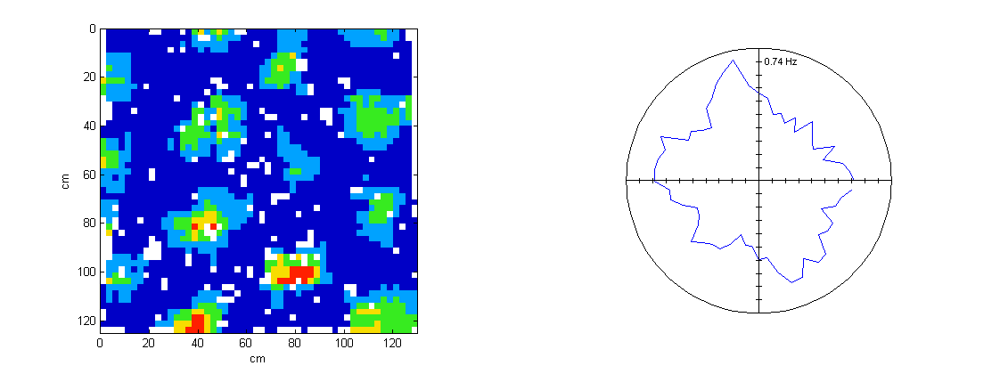
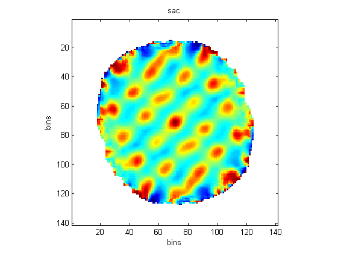
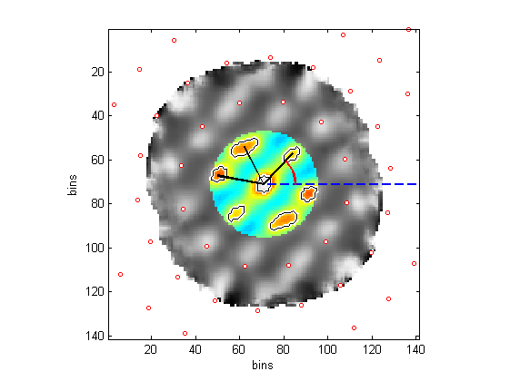

### analysis-matlab aka mTint   
Code and documentation within this repository are private - only people who have been given access will be able to view it and/or contribute.   

_Note that this repository has been moved to a new home at github.com/ucl-hippocampus/analysis-matlab (it was previously located at github.com/ucl/mTint)._

This file has several sections:   
* [Using the code](#using_the_code) - explains how to get the code and how to load up some data   
* [Analysis folders](#analysis_folders) - describes how functions are organised within the respository   
* [Contributing](#contributing) - gives some pointers for people contributing code and/or documentation
* [About](#about) - a bit of background on Tint, mTint, and this repository

### <a name="using_the_code"/> Using the code

**A zip file of the latest version of code can be downloaded [here](https://github.com/ucl-hippocampus/analysis-matlab/archive/master.zip)**   
(this is the same link as that provided on the right hand side of most pages on the site).

As a user of this project you are a member of one of the two project _teams_ (if you are reading this page then you must already be in one of these teams).  One team has full admin rights to the project, the other team can only download copies of the code. 

**To begin, you'll want to use the [load_trial](LoadData#load_trial) function in the [LoadData](LoadData) folder** (follow links to go to documentation). To perform specific analysis you'll need to explore the other folders and their associated documentation. 

**Function calling convention &#9827;.** Many functions in the documentation are labeled with a &#9827; symbol (e.g. [load_trial](LoadData#load_trial)).  This indicates that the function conforms to the following convention:   
+ *For zero inputs* the function will return a structure showing the expected inputs and their default values.    
+ *For one input, where the input is a structure,* the function will use the values specified by the structure, and if necessary it will add additional fields from the default structure.    
+ *For an even number of inputs, where the first input is a string,* the function will treat the inputs as a list of alternating field-names and field values, defining a structure to be used as above.   
+ *For two inputs, where the first input is a structure,* the first input will be treated as above, but the second input should be a number specifying the version of the code you are expecting to run.  The function will check this number and give an error if it doesn't match the version number stated in the current code.  Although this requires some extra effort it will make your life easier when you come to run some old code that was designed to work with a now superseded function - instead of the code running and giving some weird error, it will tell you that the version number is wrong and you can then either download a copy of the old code from GitHub or modify you code to work with the new version of the function.    

These &#9827;-functions are also designed to return a single output structure rather than many individual variables.

Here are a few examples of typical usage:
```matlab
myTrial = load_trial('data_path','C:\','flnmroot','R3104 Aug10');
```
```matlab
tmp = load_trial;
tmp.data_path = 'C:\';
tmp.flnmroot = 'R3104 Aug10';
myTrial = load_trial(tmp);
```
```matlab
tmp = load_trial;
tmp.data_path = 'C:\';
tmp.flnmroot = 'R3104 Aug10';
myTrial = load_trial(tmp,2.1); //Note the version number specified here
```
Note that the advantage of using a structure is you can use auto-complete (i.e. type `tab`) and get a list of all the fields.   

### <a name="analysis_folders"/> Analysis Folders
* [LoadData](LoadData) - functions for reading in DACQ file and performing basic post-processing such as smoothing position data and converting EEG values to volts.   
* [GridAnalysis](GridAnalysis) - functions for producing ratemaps, perfoming spatial correlations and finding the length, scale, gridness etc. of the cell.  


   
* [FreqAnalysis](FreqAnalysis) - functions for working with theta, using both EEG data and using cell spiking data.   

   
* [FFT2Analysis](FFT2Analysis) -  functions for doing the spatial frequency analysis described in [this paper](http://www.sciencemag.org/content/337/6096/853.abstract).   
* [CircularStats](CircularStats) - functions for working with circular variables such as direction or theta-phase.  
* [PhasePrecession](PhasePrecession) - functions for doing the 2D theta phase precession analysis decribed in [this paper](?).
* [Plotting](Plotting) - miscellaneous functions for plotting data and exporting to pdf      
* [Miscellaneous](Miscellaneous) - miscellaneous helper functions used elsewhere, plus the error-recovery function [fix_binary_data](Miscellaneous#fix_binary_data).   


### <a name="contributing"/> Contributing
If you are contributing code please provide documentation in a readme file.  If possible link to other relevant functions and provide an example plot of the output of your code.  A diagram or link to a paper would also be nice.

If you are using code and find the documentation on the readme lacking, please consider contributing to it, though perhaps make it clear that you are not the author of the function and could be wrong.

**Images and links**   
To link to the documentation in another folder do `[go here please](SomeFolder)`.   

To include an image, do ``.  The image can be anywhere within the repository, but it is best to keep images in a sub fodler within each analysis folder.  You can change the size of the image by adding `width="100px"` between `img` and `src=`.  To include a publicly avaialble image you can just give the full url.   

To create an anchor within a page do `<a name="imporantThing"/>`.  You can then link to the anchor by doing `[go there](ThatFolder#importantThing)`, within the page itself you can ommit the `ThatFolder`, i.e. just use `[go there](#importantThing)`.   

**Code**    
There are two types of code: `this is inline`, and...
```matlab
this == block('code');
Matlab.style;
```

To do inline:   
```markdown
    standard text `this is inline` this is standard text
```

To do block:
```markdown
    ```matlab
    this == block('code');   
    Matlab.style;
    ```
```

Note the \` symbol is the one top left on a normal keyboard (below escape).   
   

### <a name="about"/> About Tint and mTint and this repository

**Tint** is a standalone application for Windows (and other OSes?) that reads in data files produced by DACQ during a recording session. Spikes can be viewed and cluster cut either manually or with one of the clustering algorithms provided. Once a cell's spikes have been identified a variety of analyses can be performed, in particular spatial and directional ratemaps can be plotted as well as temporal correlations. EEG data can also be displayed and analysed. The software is sold and developed by Jim Donnett through his company Axona, though it was initially written by Neil Burgess.

Originally, **mTint** was very similar to Tint but written in Matlab. Although this meant it was a lot slower to run and probably less user friendly, it made it possible for individuals to write custom scripts and functions to analyse their data in novel ways. Mike Anderson did the initial porting from C to Matlab and most subsequent work, though for the first few years most of the code went unused.  In 2013 Mike did a major re-write to make mTint much faster and include a large number of new features, not present in Tint.  This newer version of mTint exists as a compiled "stand-alone" application and also as a set of normal-looking Matlab files.

For those of you interest in working in Python rather than Matalb, take a look at the **pTint** branch of this mTint repo.  The pTint code isn't really intended for general consuption yet, but it may possibly be at some point in the future.

**This repository** was originally set up by Daniel Manson in 2013 with the name "mTinT", it was within the UCL github "organisation", paid for by UCL's Research IT Services. In the summer of 2015 the repository was moved to its new home within the "ucl-hippocampus" organisation. This organisation is registered with github as being engaged in non-comerical accademic research, and as such is eligible for github's silver-level features such as free private repositories and hidden teams.  Robin and Daniel are the mangers of this organisation. Note that although the repository was originally called "mTint" it is actually a bit different to mTint as there is no GUI, and there are additional analysis functions not in mTint.
